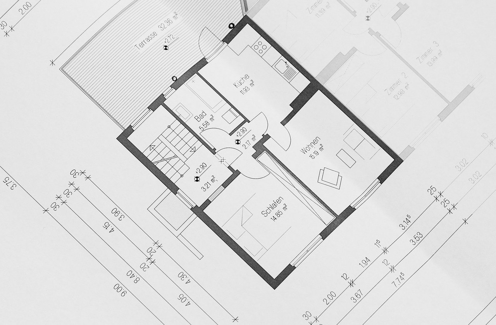

```{r setup, include=FALSE}
library(learnr)
library(knitr)
library(ggplot2)
library(dplyr)
library(tidyr)
library(emojifont)
library(ggthemes)

theme.fom <- theme_classic(22*1.04)
theme.fom <- theme.fom
theme_set(
  theme.fom  
)

# deutsche Version von random_praise
source("random-praise_de/translation_random-praise_de.R")


library(ggdag)
# DAG
co <- data.frame(x=c(0,1,2), y=c(0,1,0), name=c("X", "Z", "Y"))
DAG_Fork <- dagify(X ~ Z,
                   Y ~ Z,
                   Y ~ X,
                   coords = co) %>% 
  ggdag() + 
  geom_dag_point(colour = c("#0000FF", "#DA70D6", "#0F710B")) + 
  geom_dag_text(size = 8) +
  theme_dag_blank() +
  geom_dag_edges(arrow_directed = grid::arrow(length = grid::unit(15, "pt"), type = "closed")) +
  geom_text(label = "X - Zimmer\nZ - Fläche\nY - Preis", 
            hjust = 1, vjust = 1,
            x = 2, y = 1, size = 7, color = "darkgrey") 


library(mosaic)
data("SaratogaHouses")

erglm1 <- lm(price ~ rooms, data = SaratogaHouses)
erglm2 <- lm(price ~ rooms + livingArea, data = SaratogaHouses)

options(scipen = 999)
```

## Lernziele

In diesem Modul lernen Sie:

- dass aus einer Beobachtung nicht immer eine Handlung abgeleitet werden kann.

## Immobilienpreis

Wie viel ist meine Immobilie Wert?


<!-- style="padding-left:50px;" -->
<span style="font-size: 10px;"><br>
Quelle: [https://pixabay.com/de/photos/bauplan-grundriss-architektenplan-354233/](Quelle: https://pixabay.com/de/photos/bauplan-grundriss-architektenplan-354233/)
</span>


Vielleicht am einfachsten zu zählen: Die Anzahl Zimmer.

Im `R` Paket `mosaicData` gibt es einen Immobiliendatensatz: `SaratogaHouses`.

Schauen wir uns dort den Zusammenhang zwischen Anzahl Zimmer (`rooms`) und Preis (`price`) einmal an:

```{r desi}
# Vorbereitungen: Paket und Daten laden
library(mosaic)
data(SaratogaHouses)

# Streudiagramm
gf_point(price ~ rooms, data = SaratogaHouses) %>%
  gf_lm() # Regressionsgerade ergänzt
```

Wir sehen: Je mehr Zimmer, desto höher der Preis &ndash; im Mittelwert.

## Lineare Regression - 1. Versuch

Gehen wir von einem linearen Zusammenhang zwischen <green>Anzahl Zimmer</green> (`rooms`), $\color{green}{x}$, und <blue>Preis</blue> (`price`), $\color{blue}{y}$, aus:

$$\color{blue}{y}_i = \beta_0 + \beta_1 \cdot \color{green}{x}_i + \epsilon_i$$
Dabei ist $\beta_1$ die Steigung, die den (linearen) Zusammenhang beschreibt, $\beta_0$ der $y$-Achsenabschnitt.

Geschätzt werden können die Koeffizienten $\beta_0, \beta_1$ mit Hilfe der Daten:

```{r lm1}
erglm1 <- lm(price ~ rooms, data = SaratogaHouses)
erglm1
```

Also:

$$\hat{\color{blue}{y}}_i = `r round(coef(erglm1))[1]` + `r round(coef(erglm1))[2]` \cdot \color{green}{x}_i $$

```{r Steigung, echo=FALSE}
message <- "Die anhand der Stichprobe im linearen Modell geschätzte Steigung liegt bei $\\hat{\\beta}_1= 22573$, der geschätzte Achsenabschnitt, also der Mittelwert des Preises bei $x=0$ Räumen, bei $\\hat{\\beta}_0=53016$."
question("Im linearen Modell der Stichprobe: Um wieviel erhöht sich der Preis pro Raum?",
         answer("53016"),
         answer("22573", correct = TRUE, message = message),
		allow_retry = TRUE,
		correct = random_praise(),
		incorrect = random_encouragement()
         )
```

##

Aktuell hat meine Wohnung gemäß Grundriss 4 abgetrennte Räume, also  <green>Anzahl Zimmer</green> (`rooms`), $\color{green}{x}=\color{green}{4}$.

Damit liegt der Mittelwert des Preises für meine Wohnung bei

$$\hat{\color{blue}{y}} = `r round(coef(erglm1))[1]` + `r round(coef(erglm1))[2]` \cdot \color{green}{4}= \color{blue}{`r round(coef(erglm1))[1]+  round(coef(erglm1))[2]*4`}.$$

##


<!-- style="padding-left:50px;" -->
<span style="font-size: 10px;"><br>
Quelle: [https://pixabay.com/de/vectors/idee-erfindung-erfinder-denken-152213/](Quelle: https://pixabay.com/de/vectors/idee-erfindung-erfinder-denken-152213/)
</span>

Ich teile einfach mein Wohnzimmer auf. Aus Eins mach Zwei, aus $4$ Zimmern werden $5$, $\color{green}{do(x)}=\color{green}{5}$. Dann gilt gemäß des Modells:

$$\hat{\color{blue}{y}} = `r round(coef(erglm1))[1]` + `r round(coef(erglm1))[2]` \cdot \color{green}{5}= \color{blue}{`r round(coef(erglm1))[1]+  round(coef(erglm1))[2]*5`}.$$

```{r Wertsteigerung, echo=FALSE}
message <- "Das geschätzte lineare Modell der Stichprobe bezieht sich auf die Beobachtungsdaten ($X=x$), d. h. die Steigung beschreibt die beobachtete Änderung des Mittelwertes, nicht den Effekt einer Handlung $do(X=x)$."
question("Erhöht die Raumteilung den Preis meiner Immobilie im Mittelwert um $22573$?",
         answer("Ja"),
         answer("Nein", correct = TRUE, message = message),
		allow_retry = TRUE,
		correct = random_praise(),
		incorrect = random_encouragement()
         )
```

## Wiederholung: Elemente Kausaler Diagramme

In den Module 4, 5 und 6 haben Sie die Grundelemente kausaler Diagramme kennengelernt:


| Pfad                       | $\color{green}{X} \rightarrow \color{violet}{Z} \rightarrow \color{blue}{Y}$ | $\color{green}{X} \leftarrow \color{violet}{Z} \rightarrow \color{blue}{Y}$  | $\color{green}{X} \rightarrow \color{violet}{Z} \leftarrow \color{blue}{Y}$ 
| ---------------------------|---------------------------------|---------------------------------|------------------------------|
| Name                       | Kette                           | Gabel                           | Umgedrehte-Gabel         
| Verbindung $\color{green}{X}$ und $\color{blue}{Y}$     | Kausal                          | Nicht-kausal                    | Keine                       
| Rolle von $\color{violet}{Z}$              | Mediator                        | Confounder                      | Collider
| Adjustierung $\color{violet}{Z}$           | Unterbricht kausalen Pfad       | Unterbricht nicht-kausalen Pfad | Öffnet Schein-Pfad


**Grundidee**: Um die Änderung von $\color{blue}{y}$ zu schätzen, wenn $\color{green}{x}$ verändert wird, sollten nicht-kausale Pfade unterbrochen werden (*Gabel*), kausale Pfade nicht (*Kette*). Auch sollten keine Schein-Pfade aufgemacht werden (*Umgedrehte-Gabel*). Während also in einer Kette und Umgedrehten-Gabel für $\color{violet}{Z}$ nicht adjustiert werden sollte, sollte es in einer Gabel erfolgen.

<br>

Überlegen Sie, welcher *Confounder* hier vorliegen könnte?

*Denken Sie bitte kurz darüber nach und klicken Sie erst dann auf `Nächstes Thema`*

##

<violet>Wohnfläche</violet> könnte eine gemeinsame Ursache von <green>Anzahl Zimmer</green> und <blue>Preis</blue> sein.

```{r DAG_Fork, echo=FALSE, fig.align='center', out.width='85%'}
plot(DAG_Fork)
```


```{r graph1, echo=FALSE}
message <- "Neben dem direkten Effekt über $Z \\rightarrow Y$ gibt es auch den indirekten $Z \\rightarrow X \\rightarrow Y$. Hierbei ist die **Anzahl Räume** ein **Mediator**."
question("Welcher Teilgraph liegt vor, wenn die Beziehung zwischen Fläche und Preis im Zusammenhang mit der Anzahl Räume analysiert wird?",
         answer("Kette", correct = TRUE, message = message),
         answer("Gabel"),
         answer("Umgedrehte-Gabel"),
		allow_retry = TRUE,
		correct = random_praise(),
		incorrect = random_encouragement()
         )
```

```{r graph2, echo=FALSE}
message <- "Neben dem direkten Effekt über $X \\rightarrow Y$ gibt es auch den nicht-kausalen $X \\leftarrow Z \\rightarrow Y$. Hier ist die **Fläche** ein **Confounder**."
question("Welcher Teilgraph liegt vor, wenn die Beziehung zwischen der Anzahl Zimmer und Preis im Zusammenhang mit der Fläche analysiert wird?",
         answer("Kette"),
         answer("Gabel", correct = TRUE, message = message),
         answer("Umgedrehte-Gabel"),
		allow_retry = TRUE,
		correct = random_praise(),
		incorrect = random_encouragement()
         )
```

## Lineare Regression - 2. Versuch

<violet>Wohnfläche</violet> liegt in der Datentabelle als Variable `livingArea` vor. Ergänzen Sie das Modell entsprechend.

```{r lm, exercise=TRUE, eval=FALSE}
lm(price ~ rooms + ___, data = SaratogaHouses)
```

```{r lm-solution}
lm(price ~ rooms + livingArea, data = SaratogaHouses)
```

Was fällt Ihnen auf?

##

```{r lms}
# Modell ohne Wohnfläche
lm(price ~ rooms, data = SaratogaHouses)
# Modell mit Wohnfläche
lm(price ~ rooms + livingArea, data = SaratogaHouses)
```

Gegeben die <violet>Wohnfläche</violet> ist der Effekt der <green>Anzahl Räume</green> auf den <blue>Preis</blue> viel kleiner. Statt einer geschätzten Steigung von $\hat{\beta}_1=`r round(coef(erglm1))[2]`$ im Modell *ohne* Berücksichtigung der <violet>Wohnfläche</violet> haben wir *mit* Berücksichtigung nur noch eine Steigung von $\hat{\beta}_1=`r round(coef(erglm2))[2]`$.

Auch wenn dies immer noch ein stark vereinfachtes Modell ist: Der kausale Effekt der Anzahl Räume auf den Preis ist im Modell mit der Wohnfläche (`price ~ rooms + livingArea`) realistischer als der ohne (`price ~ rooms`).

##

```{r DAG_Fork2, echo=FALSE, fig.align='center', out.width='85%'}
plot(DAG_Fork)
```

```{r adjustierung, echo=FALSE}
message <- "Welche Variablen ins Modell aufgenommen werden sollen, hängt davon ab welcher kausale Effekt bestimmt werden soll. Hier würde das Modell `price ~ livingArea + rooms` den (indirekten) kausalen Pfad von Fläche über Zimmer zu Preis unterbrechen. Das korrekte Modell wäre daher  `price ~ livingArea`."
question("Wenn die erwartete Änderung des Preises, wenn die Fläche erhöht wird, analysiert werden soll. Sollte dann für die Anzahl Zimmer adjustiert werden?",
         answer("Ja", message = "Welche Variablen ins Modell aufgenommen werden sollen, hängt davon ab welcher kausale Effekt bestimmt werden soll."),
         answer("Nein",correct = TRUE, message = message),
		allow_retry = TRUE,
		correct = random_praise(),
		incorrect = random_encouragement()
         )
```


## Hinweis

<red> **Dieser Kurs ist aktuell noch in der Entwicklung!** </red>

Bitte melden Sie Fehler, Unklarheiten und Verbesserungsvorschläge [hier](https://github.com/luebby/WWWEKI/issues).

Das Vorhaben *Was, wie, warum? Einstiegskurs Kausale Inferenz (WWWEKI)* wird mit Mitteln des Bundesministeriums für Bildung und Forschung unter dem Förderkennzeichen 16DHBQP040 gefördert.


