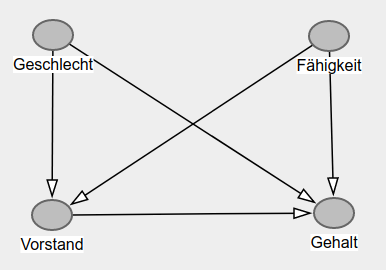
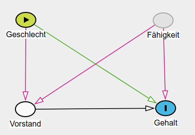

<a href="https://ki-campus.org/">

</a>

```{r setup, include=FALSE}
library(ggplot2)
library(ggdag)
theme.fom <- theme_classic(22*1.04)
theme.fom <- theme.fom
theme_set(
  theme.fom  
)

# deutsche Version von random_praise
source("random-praise_de/translation_random-praise_de.R")


library(learnr)
library(mosaic)
library(DT)

set.seed(1896)

# Stichprobenumfang
n <- 1000
# Faehigkeit N(100,15) verteilt
faehigkeit <- rnorm(n, mean = 100, sd = 15)
# Geschlecht B(0.5) verteilt
geschlecht <- sample(c("w","m"), size = n, replace = TRUE)

# "Aufstieg" ins Management ab einer faehigkeit von 115 für Männer, ab 130 für Frauen
vorstand <- ifelse(((geschlecht == "m" & faehigkeit > 115) | 
                      (geschlecht == "w" & faehigkeit > 130)),
                   "j","n")

# Gehalt: Faehigkeit * 10 * 2 (wenn Vorstand) * 1.05 (wenn Mann)
gehalt <- faehigkeit * 10 * 
  ifelse(vorstand == "j", 2, 1) * 
  ifelse(geschlecht == "m", 1.05, 1)

# Datentabelle zusammensetzen
GPG <- data.frame(
  geschlecht = geschlecht,
  faehigkeit = round(faehigkeit),
  vorstand = vorstand,
  gehalt = round(gehalt,-2))
```

## Lernziele

In diesem Modul lernen Sie:

- einen Graphen anhand einer angenommenen Kausalstruktur zu zeichnen;
- daraus die Konsequenz für die kausale Schlussfolgerung zu ziehen;
- eine Simulation für die Gender-Pay-Gap in R.

## Eine Schlagzeile

Eine Schlagzeile vom 16.11.2020 lautet ([Link](https://www.zeit.de/news/2020-11/16/frauen-im-vorstand-von-dax-firmen-verdienen-mehr-als-maenner)): 

> Frauen in Firmen-Vorständen sind besser bezahlt als Männer

Kann das sein? Mensch denkt doch immer eher, dass Frauen im Job (und beim Gehalt) *benachteiligt* werden.

Aber beides kann gleichzeitig stimmen: Frauen können im Job benachteiligt werden *und* Frauen können als Vorstand ein höheres Gehalt erzielen als Männer. 

Korrelation bedeutet nicht Kausalität. Mediatoren, Confounder und Collider lauern überall und können Verzerrungen (Bias) erzeugen.  
Um Kausalität zu untersuchen müssen wir über den datengenerierenden Prozess nachdenken: Wie sind die Daten entstanden? Hier: Wie kommen die Gehälter von Frauen und Männern in Vorstandspositionen zustande?

Und dies haben Sie in diesem Kurs gelernt &#127942;

## Die Annahmen

Hier unsere qualitativen Annahmen des datengenerierenden Prozesses:

1. Die *Fähigkeit* für den (Vorstands-)Job ist unabhängig vom *Geschlecht*.

2. Ob jemand in den *Vorstand* kommt, hängt ab von der *Fähigkeit* und dem *Geschlecht*. 
(Für letzteres kann es unterschiedlichste Erklärungen geben: Beispielsweise kann es sein, dass Frauen weniger in solche Positionen befördert werden; es kann aber auch sein, dass sie sich weniger für solche Positionen interessieren.)

3. Das *Gehalt*, das eine Person bekommt, hängt ab von der *Fähigkeit*, von der Tätigkeit als *Vorstand* und zumindest potentiell auch vom *Geschlecht*.

```{r pfeil1, echo=FALSE}
question("Gibt es einen Pfeil zwischen *Fähigkeit* und *Geschlecht*?",
  answer("Ja, in der Form *Fähigkeit* $\\rightarrow$ *Geschlecht*."),
  answer("Ja, in der Form *Geschlecht* $\\rightarrow$ *Fähigkeit*."),
  answer("Nein.", correct = TRUE, message = "Wir nehmen hier an, dass es keinen Zusammenhang zwischen *Fähigkeit* und *Geschlecht* gibt, daher gibt es auch keinen Pfeil."),
  allow_retry = TRUE,
  correct = random_praise(),
  incorrect = random_encouragement()
)
```

<br>

```{r pfeil2, echo=FALSE}
question("Gibt es einen Pfeil zwischen *Fähigkeit* und *Vorstand*?",
  answer("Ja, in der Form *Fähigkeit* $\\rightarrow$ *Vorstand*." , correct = TRUE, message = "Wir nehmen an, dass die Vorstandstätigkeit von der Fähigkeit abhängt &ndash; und nicht umgekehrt."),
    answer("Ja, in der Form *Vorstand* $\\rightarrow$ *Fähigkeit*."),
  answer("Nein."),
  allow_retry = TRUE,
  correct = random_praise(),
  incorrect = random_encouragement()
)
```

## DAGitty

[DAGitty](http://dagitty.net/) ist ein einfach, auch im Browser, zu bedienendes Tool, mit dem Sie kausale Diagramme zeichnen (und analysieren) können.

*Hinweis*: Für die Diagramme innerhalb dieses Kurses wurde das Paket `ggdag` ([https://ggdag.malco.io/](https://ggdag.malco.io/)) verwendet.

Zeichnen Sie dort &ndash; oder auf einem Blatt Papier &ndash; das Diagramm, dass folgende Annahmen darstellt:

1. Die *Fähigkeit* für den (Vorstands-)Job ist unabhängig vom *Geschlecht*.
2. Ob jemand in den *Vorstand* kommt, hängt ab von der *Fähigkeit* und dem *Geschlecht*.
3. Das *Gehalt*, das eine Person bekommt, hängt ab von der *Fähigkeit*, von der Tätigkeit als *Vorstand* und vom *Geschlecht*.

*Klicken Sie erst danach zur Kontrolle auf `Weiter`*

##

<br>

{width="65%"}

1. Die *Fähigkeit* für den (Vorstands-)Job ist unabhängig vom *Geschlecht*. Daher kein Pfeil zwischen diesen Variablen.
2. Ob jemand in den *Vorstand* kommt, hängt ab von der *Fähigkeit* und dem *Geschlecht*. Daher sowohl ein Pfeil von *Geschlecht* zu *Vorstand* als auch von *Fähigkeit* zu *Vorstand*.
3. Das *Gehalt*, das eine Person bekommt, hängt ab von der *Fähigkeit*, von der Tätigkeit als *Vorstand* und vom *Geschlecht*. Daher jeweils ein Pfeil von *Fähigkeit*, *Vorstand* und *Geschlecht* zu *Gehalt*.


```{r collider, echo=FALSE}
question("Welche Rolle spielt *Vorstand* im Teilgraphen mit *Geschlecht* und *Fähigkeit*?",
  answer("Mediator"),
  answer("Confounder"),
  answer("Collider", correct = TRUE, message = "Korrekt &ndash; die beiden Pfeile zeigen beide auf *Vorstand*."),
         allow_retry = TRUE,
         correct = random_praise(),
         incorrect = random_encouragement())
```

## Eine Simulation

Treffen wir zusätzlich noch quantitative Modellannahmen für das Beispiel:

1. `faehigkeit` ist normalverteilt mit $\mu=100$ und $\sigma=15$.

2. `geschlecht` ist bernoulliverteilt mit einer Wahrscheinlichkeit von $\pi=0.5$ für eine Frau.

3. Ob jemand im Vorstand ist, hängt ab von `faehigkeit` und `geschlecht`. Dies modellieren wir indem ein Mann ab einer `faehigkeit` größer als 115 in den Vorstand kommt, eine Frau erst ab 130. Frauen müssen also fähiger sein als Männer um in den Vorstand zu kommmen &ndash; so hier die Annahme.


```{r plot, echo=FALSE, fig.align='center', out.width="60%", message=FALSE}
xpnorm(115, mean = 100, sd = 15, return = "plot") %>% gf_labs(title = "Vorstand  für Männer", x = "Fähigkeit", y = "Dichte")
xpnorm(130, mean = 100, sd = 15, return = "plot") %>% gf_labs(title = "Vorstand  für Frauen", x = "Fähigkeit", y= "Dichte")
```


4. Das `gehalt` setzt sich zusammen aus `faehigkeit` ($\cdot 10$). Es ist im `vorstand` doppelt so hoch und für Männer noch einmal $5\%$ höher. Fähigere Leute verdienen mehr, Mitglieder des Vorstands verdienen mehr und Männer verdienen mehr.
$$\text{gehalt} = \text{faehigkeit} \cdot 10 \cdot \begin{cases}2, \,\text{ist Vorstand} \\ 1, \,\text{sonst} \end{cases} \cdot \begin{cases}1.05, \,\text{ist Mann} \\ 1, \,\text{sonst} \end{cases}.$$
```{r plot2, echo=FALSE, fig.align='center', out.width="60%", message=FALSE}
mov <- data.frame(x1 = 50, x2 = 115, y1 = 50*10*1.05, y2=115*10*1.05)
miv <-  data.frame(x1 = 115, x2 = 150, y1 = 115*10*2*1.05, y2=150*10*2*1.05)
fov <- data.frame(x1 = 50, x2 = 130, y1 = 50*10*1, y2=115*10*1)
fiv <-  data.frame(x1 = 130, x2 = 150, y1 = 115*10*2*1, y2=150*10*2*1)
gf_segment(y1 + y2 ~ x1 + x2, data = mov, color = "purple") %>%
  gf_segment(y1 + y2 ~ x1 + x2, data = miv, color = "purple") %>%
  gf_segment(y1 + y2 ~ x1 + x2, data = fov, color = "orange") %>%
  gf_segment(y1 + y2 ~ x1 + x2, data = fiv, color = "orange") %>%
  gf_labs(x="Fähigkeit", y="Gehalt") +
  annotate("text", label="Männer", x = 60, y= 3000, color = "purple")+
  annotate("text", label="Frauen", x = 60, y= 2500, color = "orange")
```


Um dies in `R` für z. B. $n=1000$ Mitarbeiter:innen zu simulieren kann folgender Code verwendet werden:

```{r simData}
# Paket aktivieren
library(mosaic)
# Zufallszahlengenerator initiieren
set.seed(1896)

# Stichprobenumfang
n <- 1000
# Faehigkeit: N(100,15) verteilt
faehigkeit <- rnorm(n, mean = 100, sd = 15)
# Geschlecht: B(0.5) verteilt
geschlecht <- sample(c("w","m"), size = n, replace = TRUE)

# "Aufstieg" ins Management: ab einer faehigkeit von 115 für Männer, ab 130 für Frauen
vorstand <- ifelse(((geschlecht == "m" & faehigkeit > 115) | 
                      (geschlecht == "w" & faehigkeit > 130)),
                   "j","n")

# Gehalt: Faehigkeit * 10 * 2 (wenn Vorstand) * 1.05 (wenn Mann)
gehalt <- faehigkeit * 10 * 
  ifelse(vorstand == "j", 2, 1) * 
  ifelse(geschlecht == "m", 1.05, 1)

# Datentabelle zusammensetzen, Werte runden
GPG <- data.frame(
  geschlecht = geschlecht,
  faehigkeit = round(faehigkeit),
  vorstand = vorstand,
  gehalt = round(gehalt,-2))
```

<br>
<span style="color:#301a87;">&#10146;</span> Ein Einblick in die simulierten Daten:

```{r, echo=FALSE}
datatable(GPG)
```


## Analyse 1

Wie konstruiert gemäß unserer Annahmen: 

Es gibt keine nennenswerten Unterschiede (hier: im arithmetischen Mittelwert, engl. mean; Funktion `mean()`) in der Fähigkeit zwischen den Geschlechtern:

```{r meanf}
mean(faehigkeit ~ geschlecht, data = GPG)
```

Und im Gehalt? 

Ändern Sie den Code so, dass Sie den arithmetischen Mittelwert der Variable `gehalt` je Geschlecht ausgeben:

```{r meang, exercise = TRUE}
mean(faehigkeit ~ geschlecht, data = GPG)
```

```{r meang-solution}
mean(gehalt ~ geschlecht, data = GPG)
```

##

Wie konstruiert: 

Männer verdienen im Durchschnitt mit `r round(mean(gehalt ~ geschlecht, data = GPG))[1]` mehr als Frauen, deren Durchschnittsgehalt hier bei `r round(mean(gehalt ~ geschlecht, data = GPG))[2]` liegt.

## Analyse 2

Was passiert, wenn wir uns auf die Vorstandsmitglieder beschränken, d. h., wir wählen (`filter`) nur die Beobachtungen aus, die die Bedingung erfüllen, dass sie im Vorstand sind (`vorstand == "j"`):

```{r meangvorstande, exercise = TRUE}
GPG %>%
  filter(vorstand == "j") %>%
  mean(gehalt ~ geschlecht, data = .)
```

## 

```{r meangvorstand}
GPG %>%
  filter(vorstand == "j") %>%
  mean(gehalt ~ geschlecht, data = .)
```

Obwohl Männer nach Konstruktion insgesamt mehr verdienen, verdienen Frauen im Vorstand mehr.

Warum?

Weil sie fähiger sein mussten, um in den Vorstand zu kommen.

Kontrollieren Sie dies, indem Sie den Code so abändern, dass Sie den arithmetischen Mittelwert der Variable `faehigkeit` je Geschlecht für die Vorstandsmitglieder ausgeben.

```{r meanfvorstand, exercise = TRUE}
GPG %>%
  filter(vorstand == "j") %>%
  mean(gehalt ~ geschlecht, data = .)
```

```{r meanfvorstand-solution}
GPG %>%
  filter(vorstand == "j") %>%
  mean(faehigkeit ~ geschlecht, data = .)
```

<br>

Und das Gehalt hängt ja, neben dem Geschlecht und der Tätigkeit im Vorstand auch von der Fähigkeit ab &ndash; so hier die Annahme.

## Verzerrung

Wie in Modul 6 besprochen: 

Adjustierung eines Colliders (Tätigkeit im Vorstand) erzeugt eine Verzerrung, es wird ein Scheinzusammenhang erzeugt, der den Effekt des Geschlechts auf das Gehalt verzerrt. Mit [DAGitty](http://dagitty.net/) kann dies schön gezeigt werden:

{width="75%"}

Das folgende Vidoeo zeigt eine kurze Einführung in die Bedienung von DAGitty anhand dieses Beispiels:

{width="75%"}


## Hinweis


***

<red> **Dieser Kurs ist aktuell noch in der Entwicklung!** </red>

Bitte melden Sie Fehler, Unklarheiten und Verbesserungsvorschläge [hier](https://github.com/luebby/WWWEKI/issues).

Das Vorhaben *Was, wie, warum? Einstiegskurs Kausale Inferenz (WWWEKI)* wird mit Mitteln des Bundesministeriums für Bildung und Forschung unter dem Förderkennzeichen 16DHBQP040 gefördert.


